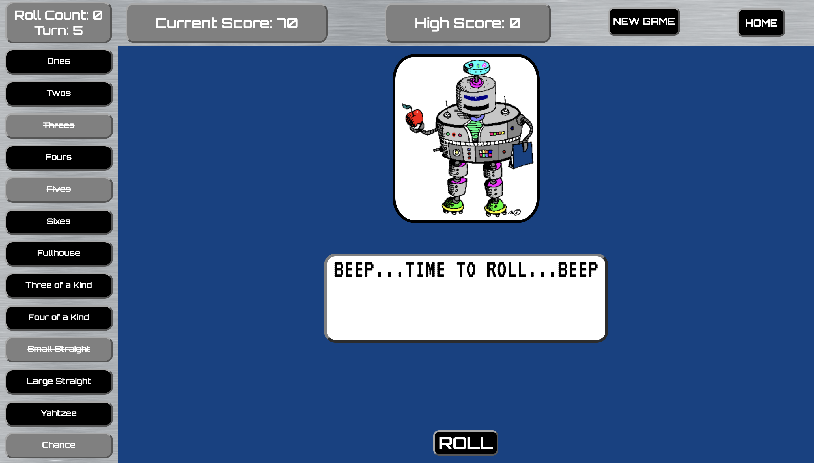
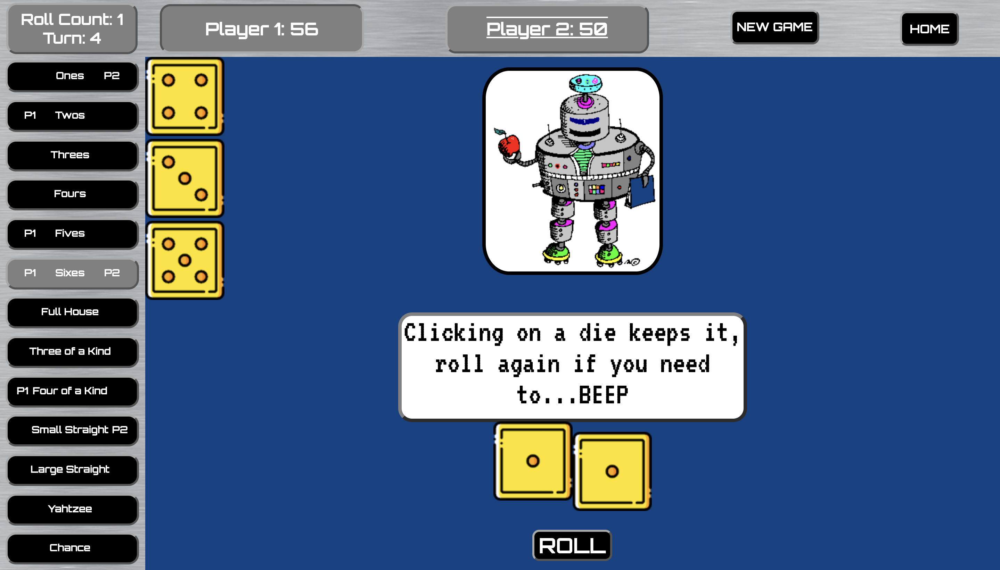
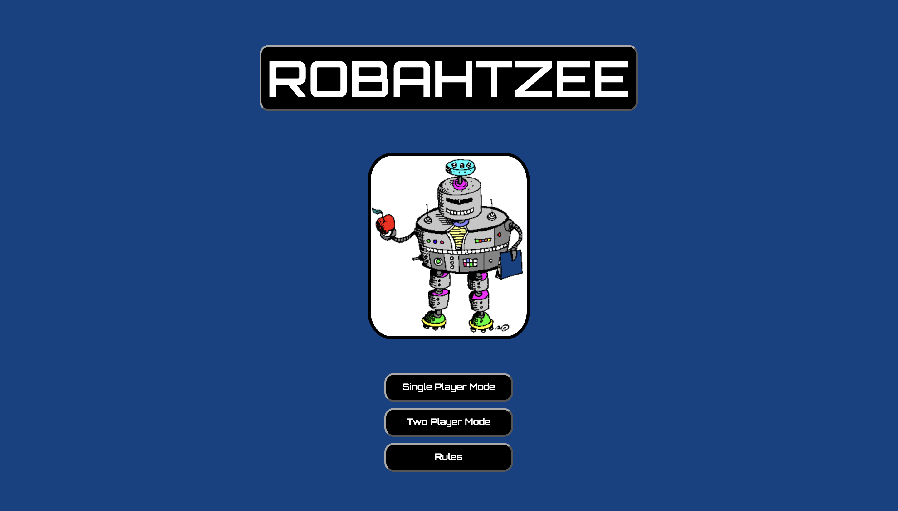
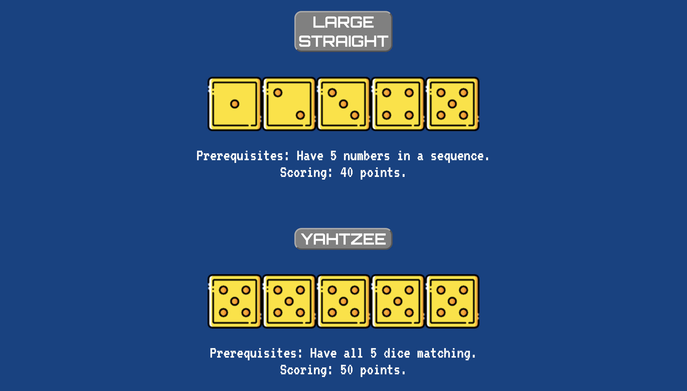

# Robahtzee
## Date: 5/17/2021
## By Brady Roscher
[GitHub](https://github.com/bradyroscher) | [Trello](https://trello.com/b/58WFAnj2/yahtzee) | [Project](https://robahtzee.surge.sh)
___
## Technologies Used
___
* HTML
* CSS
* JavaScript
___
## Description
___
#### Robahtzee is a JavaScript Yahtzee game I've made for a school project. Making use of HTML, CSS and JavaScript, I've created a fully functional game with replayability. Even after completion there's a few features to be added. Some I've already done, like the two-player mode, and some that will be an interesting challenge to come back too, like the CPU-mode.
___
## Getting Started
___
Click on the Project link at the beginning of the page to get things going. Be sure to go to the rules page to read how to play Yahtzee if you don't know, or if you need a quick refresher. Then all you need to do is choose which mode to play and start having fun!
## Updates
___
- [x] ~~Rules Page~~
- [x] ~~Two Player Mode~~
- [x] ~~Dice Animation & Sound Effects~~
- [ ] Yahtzee Celebration
- [ ] CPU Mode
___
## Screenshots
___
***SINGLE PLAYER*** 

***TWO PLAYER***

***HOME SCREEN***

***RULES***

___
## Credits
___
* [Mixkit](https://mixkit.co/free-sound-effects/) - Used for sound effects
* [Clipart-Library](http://clipart-library.com/) [flaticon](https://www.flaticon.com/) - Used for images
* [W3schools](w3schools.com/howto/howto_js_typewriter.asp) - Typewriter effect